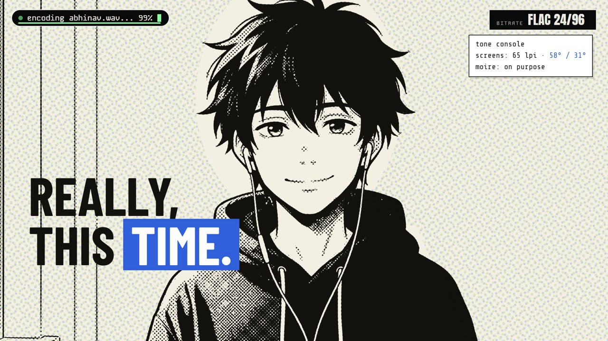
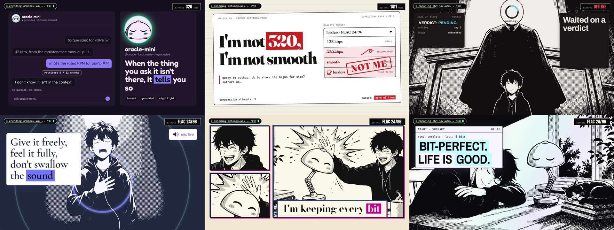

# Lossless



**A music video drawn entirely in code.** It runs 4 minutes 8 seconds and has 67 scenes, and each scene uses its own
design language. The manga art is traced into vectors, and every frame is JavaScript. Tap the film to restyle it live
while it plays.

**Watch:** [abhinavflac.dev/lossless](https://abhinavflac.dev/lossless)

> *They told me I wouldn't notice what they threw away. I noticed.*

"Lossless" is a song about refusing to be compressed. FLAC versus MP3 is the metaphor for a life. The song draws on
2 a.m. Arch updates, custom ROMs, a little RAG oracle that answers "I don't know", an account locked by a machine and
handed back with no reason, a DBSCAN run that files you under noise, and learning to give freely and feel fully.



---

## How it was made

```
 lyrics ─▶ Suno ─▶ song.wav ─┬─▶ vocal stem ─▶ ElevenLabs forced alignment ─▶ song/timing.json   every word, to the ms
                              └─▶ beat grid ────────────────────────────────▶ song/beats.json    90.99 BPM, G minor

 scenes.json      67 scenes, one per lyric line: an idea, a mode (manga · ui · terminal · pop), a Katagami design language
   ├─ ui · terminal · pop ─▶ fake software UIs in HTML + GSAP, each in its own design language   scenes-src/
   └─ manga ─▶ reference image (refs/PROMPTS.md) ─▶ blur + quantise + potrace ─▶ tone plates     art/

 npm run scenes ─▶ compositions/{wide,vert}/ ─▶ tools/build-film.mjs ─▶ HyperFrames ─▶ renders/wide.mp4 · renders/vert.mp4
                                                            └─▶ tools/site.mjs ─▶ site/   the tap-to-restyle page
```

- **Timing.** Captions must never lead the voice. The whole-song alignment slipped, so every line was re-aligned on its
  own clip. Disputed starts were checked by eye on spectrograms of the stem, and every hand fix is recorded with its
  reason in `song/timing-fixes.json`. The full account is in `song/NOTES.md`.
- **Looks.** The film wears Tachikiri, with one phosphor-green signal. The 67 scenes use 67 different Katagami design
  languages, and some are picked for the pun: *Shin'ya* ("late night") for the 2 a.m. ceiling, *Yoake* ("dawn") for
  "bit-perfect", and *Bouba*'s inflatable shapes for "soft landings".
- **Art.** Plainclothes is a strict two-ink manga style. Each reference image is blurred to melt its halftone dots,
  quantised into tones and traced with potrace. `art/art.js` redraws the middle tones as SVG screentone. No pixels
  ship, and every word on screen is live type.
- **Two native frames.** 16:9 and 9:16 come from one source per scene. The vertical film is laid out for the tall
  frame, not cropped from the wide one.

## How the live restyle works

The page plays the rendered MP4 with sound. That is the **Original** look. Tap the film, and the same scenes start
running live in your browser on top of the video, in a new look.

```
 ┌──────────────── #stage ────────────────┐
 │ <video> wide.mp4      owns the sound   │  ◀─ the clock everything follows
 │ <hyperframes-player>  muted, live      │  ◀─ the same scenes, restyled; shown only when a look is on
 │ tap layer · "tap to restyle it live"   │
 └────────────────────────────────────────┘
```

1. **Every scene is themeable by contract.** No scene hard-codes a colour or a font. Everything reads 15 CSS tokens:
   `--k-paper`, `--k-surface`, `--k-ink`, `--k-on-surface`, `--k-muted`, `--k-line`, `--k-accent`, `--k-accent-2`,
   `--k-accent-3`, `--k-on-accent`, `--k-font-display`, `--k-font-body`, `--k-font-mono`, `--k-radius` and `--k-shadow`.
2. **A look is only values.** Each entry in `looks.json` holds the 15 tokens from one Katagami design language, plus
   an ink ramp for the art.
3. **Restyling overrides the tokens.** The page injects one rule,
   `[data-composition-id] * { --k-accent: … !important; … }`, which beats every scene's own values at once.
4. **The art re-inks.** The traced manga is SVG, one layer per tone, so `reinkArt(inks)` only changes fills.
5. **Staying in sync.** The live player follows the video's clock and is re-seeked when it drifts more than 0.12 s.
   The film is cut into windows at scene boundaries, and only the current window and the next are loaded.
6. **Degrading gracefully.** Below about 14 fps, the page switches to flat inks. If it is still slow, the page falls
   back to the MP4 for the rest of the visit. `?live=0` forces the MP4 only.

`tools/ktokens.mjs` maps every language onto the tokens and checks 4.5:1 contrast. `tools/contrast.mjs` audits every
text element in every scene under every look.

## Repository

| Path | What it is |
| --- | --- |
| `scenes.json` | The scene plan: 67 scenes with their lines, ideas, modes and design languages |
| `scenes-src/` | One source per scene for both frames; `npm run scenes` writes `compositions/` |
| `compositions/{wide,vert}/` | `chrome.html` (the encoding pill and bitrate counter) and the hand-written `s20.html` |
| `song/` | `lyrics.json`, `timing.json` (+ fixes and the two candidates), `beats.json`, `levels.json`, `NOTES.md` |
| `art/` | Traced tone plates, and `art.js` (placement, screentone, re-inking) |
| `assets/` | `kit.js` and `kit.css`: the shared, token-driven scene helpers |
| `looks/`, `looks.json` | Per-scene picks, extracted tokens and the restyle looks |
| `refs/PROMPTS.md` | The exact image prompts for the character sheets and every shot |
| `tools/build-film.mjs` | Writes a HyperFrames project for the film, a time window or a few scenes |
| `tools/` | Alignment, tracing, scene generation, render, encode, site build and checks |
| `site/index.html`, `site/player.js`, `site/page.css` | The tap-to-restyle page (static shell, player, styles); `npm run site` builds `site/film/` next to it |
| `app/lossless/LosslessPlayer.tsx` | The same page as a React client component for the folio |
| `docs/` | `DEPLOY.md` (putting the page on a Next.js site) and the kickoff prompt |

## Preview it

```sh
npm install
npm run dev -- --film path/to/renders     # the folder that holds wide.mp4 and vert.mp4
```

This opens `http://localhost:5173/lossless/`. The first run generates the scenes, fetches the fonts and builds the live windows. Films stream from the asset host; for local copies put `wide.mp4` and `vert.mp4` in `renders/` (or pass `--film <folder>`) and open with `?assets=film`.

## Build it

You need Node 20+, Python 3.12 (`numpy pillow scipy`), FFmpeg and potrace.

```sh
npm install
npm run fonts                   # self-host the fonts every look uses        -> assets/fonts/
npm run scenes                  # scenes-src/ -> compositions/{wide,vert}/
npm run build:wide              # the whole film as a HyperFrames project   -> out/wide
npm run render:wide             # chunked render + song                     -> renders/wide.mp4
npm run encode                  # web, master and phone copies
npm run site && npm run test:site
```

`node tools/batch.mjs NAME s01,s02` builds, checks and contact-sheets a few scenes in both frames.

**Not in the repo:**

- `song/song.wav` and `song/vocals.wav`. Rendering with sound needs them, and so does re-alignment
  (`ELEVENLABS_API_KEY`, never committed).
- The reference PNGs. The traced results are already in `art/`.
- Katagami's Plainclothes gallery images, which are theirs.

## Make one like this

Everything this film needed is in this repo; the steps below are the whole method, in order.

**You need:** Node 20+, Python 3.12 with `numpy pillow scipy`, FFmpeg, potrace, and a browser for the checks. An
ElevenLabs (or FAL) key for the forced alignment, an image model for the reference art, and a music model for the song.

1. **Song and lyrics.** `song/lyrics.json` carries each line twice: `text` for the screen and `sung` for the singer and
   the aligner. Keep the take at 48 kHz.
2. **Timing.** Split the vocal stem, then force-align the lyrics on the *stem*, never the mix, and never with a phrase
   transcriber (after a pause they start a line where the previous word ended, 0.2-1.5 s early). Check what the aligner
   flags on a spectrogram and record every hand fix with its reason in `song/timing-fixes.json`. `song/beats.json` is
   the beat grid (90.99 BPM).
3. **Scene plan.** `scenes.json` holds one scene per lyric line: the idea, a mode (manga / ui / terminal / pop) and a
   Katagami design language. Two or three modes for the whole film; a new look every line reads as noise.
4. **Scenes.** `scenes-src/sNN.html` is one scene for both frames: HTML, CSS and a paused GSAP timeline. No scene
   hard-codes a colour or a font: everything reads the 15 `--k-*` tokens. `npm run scenes` writes the compositions.
5. **Art.** Generate a reference in the Plainclothes style, then blur it to melt the halftone, quantise it into tones
   and trace it with potrace (`refs/PROMPTS.md`, `tools/trace.py`). Tone layers print as SVG screentone at runtime; no
   raster ships, and every word on screen is live type.
6. **Build and render.** `npm run build:wide` writes a HyperFrames project; `npm run render:wide` renders in chunks and
   lays the song under the picture; `npm run encode` writes the web copies.
7. **Check.** `npx hyperframes check`, `node tools/contrast.mjs out/wide`, `node tools/fromto-lint.mjs`, and
   `npm run audit:looks`, which overlays every restyle look on every window and reports any text that collides.
8. **The live page.** `npm run site` builds `site/`; `npm run dev` serves it; `npm run test:site` drives it end to end.
   The films are too large for git: they live on the asset host (see [docs/DEPLOY.md](docs/DEPLOY.md)).

Rules that saved the film: captions never lead the voice; the vertical frame is composed natively, never cropped; every
font is self-hosted and every face loads before the first frame; scenes are deterministic (seeded random, no clock, no
CSS animation); colour only ever flows through the tokens; blend-mode textures stay inside their scene.

## Credits

- **Concept, direction and characters:** [abhinav](https://abhinavflac.dev)
- **Lyrics:** written with Claude
- **Code:** written with Claude (Opus 5.5 Max) in Claude Code
- **Music:** made in Suno
- **Design languages, palettes and the Plainclothes art style:** [katagami.ai](https://katagami.ai)
- **Built on:** [katagami-music-video](https://github.com/arni-labs/katagami-music-video), rebuilt on top of it
- **Renderer:** HyperFrames and GSAP

## License

The code is MIT, and the song, lyrics, artwork and films are all rights reserved. See [LICENSE](LICENSE).
